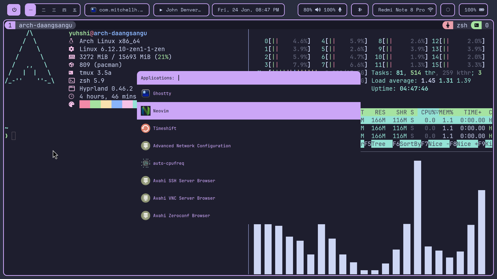

# Hyprland Dotfiles

My hyprland configurations ft. Catppuccin color scheme and Dracula GTK theme



## Installation

You don't need to back up your existing config files since this script will backup yours first. Currently limited to Arch-based distros and OpenSUSE

```bash
git clone --depth 1 https://github.com/januarpancaran/dotfiles.git
cd dotfiles
./install.sh
```
